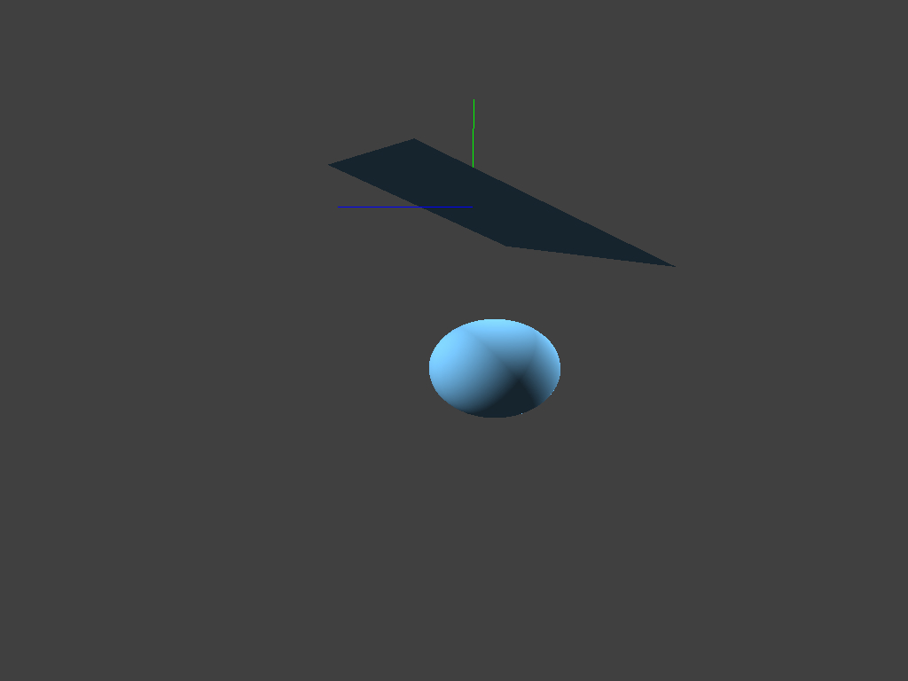

# cloth-simulation
Final Project of CS171 in ShanghaiTech

## Setup

We have upload used external libraries thus you do not have to download other libraries. But you need to create a `imgs` folder in `Coding`.

If you are using `VSCode`, we recommand using `CMake Tools`, which helps to configure, build and run the project.

## Results

Collision:

Scratch:

Cut:

