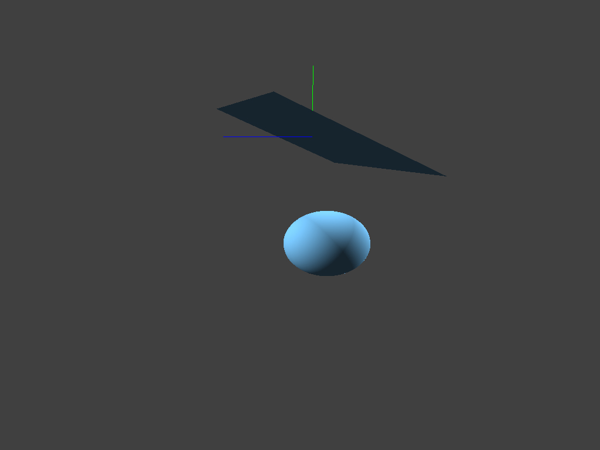

# Fast Simulation of Mass-Spring Systems

小组成员： 徐培钧，叶柯成，肖锦熙

[https://github.com/xiaojxkevin/cloth-simulation](https://github.com/xiaojxkevin/cloth-simulation)

---

## Motivation

- In hw5 we have used *(semi-implicit) symplectic Euler's method* as the solver for state iterations in a mass-spring system. However, this method is not stable, for instance, in practice `timeStep` should be set lower than $0.002$.

- Newton's method as the solver provides accurate results, but it costs time.

- To come up with a method that is **fast** and **robust** in results (in practice, we just need a `timeStep` lower than $0.01$).

---

## Notations and Background

- A mechanical system with $m$ points in 3D and $s$ springs, evolving through a discrete set of time samples $t_1, t_2, \ldots$ with constant time step $h$.
- The positions of 3D points in time $t_n$ is $\mathbf{q}_n \in \mathbb{R}^{3m}$.
- The force function is $\mathbf{f}: \mathbb{R}^{3m} \rightarrow \mathbb{R}^{3m}$. And forces are conservative, i.e., $\mathbf{f} = -\nabla E$, where $E: \mathbb{R}^{3m}\rightarrow \mathbb{R}$ is the energy function.
- Velocity of points in time $t_n$ is $\mathbf{v}_n \in \mathbb{R}^{3m}$.
- The diagonal mass-matrix is $M \in \mathbb{R}^{3m\times 3m}$.

---

## Notations and Background

- The basic implicit Euler's:
  $$
  \begin{array}
  {rcl}\mathbf{q}_{n+1} & = & \mathbf{q}_n+h\mathbf{v}_{n+1} \\
  \mathbf{v}_{n+1} & = & \mathbf{v}_n+h\mathbf{M}^{-1}\mathbf{f}(\mathbf{q}_{n+1})
  \end{array}
  $$

- Reformulation:
  $$
    \begin{aligned}
        & \mathbf{q}_{n+1}-2\mathbf{q}_n+\mathbf{q}_{n-1}=h^2\mathbf{M}^{-1}\mathbf{f}(\mathbf{q}_{n+1}) \\
        & \Rightarrow M(\mathbf{x - y}) = h^2\mathbf{f}(\mathbf{x})
    \end{aligned}
  $$
  where $\mathbf{x}\circeq \mathbf{q}_{n+1}$ and $\mathbf{y}\circeq 2\mathbf{q}_n - \mathbf{q}_{n-1}$.

- Convert to an optimization problem:
  $$
    \underset{\mathbf{x}}{\min}g(\mathbf{x}) = \frac{1}{2}(\mathbf{x}-\mathbf{y})^TM(\mathbf{x}-\mathbf{y}) + h^2 E(\mathbf{x})
  $$

---

## Method

The main problem is to define the potential energy of springs. Authors come up with the idea of introducing auxiliary unknown variables:
$$
\begin{equation}
    E_{\text{spring}} \varpropto (||\mathbf{p}_1-\mathbf{p}_2||-r)^2=\min_{||\mathbf{d}||=r}||(\mathbf{p}_1-\mathbf{p}_2)-\mathbf{d}||^2
\end{equation}
$$
where $\mathbf{p_{\{1,2\}}}$ are the endpoints of the spring, $\mathbf{d}$ is the unit direction of the spring and $r$ is the rest length.

---

## Method

The idea is to define the energy as an optimization problem. Thus with a few reformulations, we get
$$
    E(\mathbf{x}) = \underset{\mathbf{d}\in U}{\min}\frac{1}{2}\mathbf{x}^TL\mathbf{x}- \mathbf{x}^TJ\mathbf{d} - \mathbf{x}^T\mathbf{f}_{\text{ext}}
$$
where $L\in \mathbb{R}^{3m\times3m}$ is a stiffness-weighted Laplacian of the mass-spring system graph, $J\in \mathbb{R}^{3m\times3s}$ is a matrix connects mass points with springs, $U$ is the set of rest-length spring directions and $\mathbf{f}_{\text{ext}} \in\mathbb{R}^{3m}$ denotes external forces.

---

## Method

In general, we can obtain the target function as 

$$
    \underset{\mathbf{x}, \mathbf{d}\in U}{\min}g(\mathbf{x}) =  \frac{1}{2}\mathbf{x}^T(M+h^2L)\mathbf{x}- h^2\mathbf{x}^TJ\mathbf{d} - \mathbf{x}^T(h^2\mathbf{f}_{\text{ext}} + M\mathbf{y})
$$

To optimize the problem above, we can first fix $\mathbf{x}$ and solve for $\mathbf{d}$, which is defined as a local step. Then we fix $\mathbf{d}$ and solve for $\mathbf{x}$ with 
$$
(M+h^2L)\mathbf{x} = h^2J\mathbf{d} + h^2\mathbf{f}_{\text{ext}} + M\mathbf{y}
$$
and notice that $(M+h^2L)$ is PSD thus we can decompose it at the first place.

---

## Implementation

  

  Scratch Point: to make the system interactive.
  - Find the closest point $k$ with the mouse.
  - Fix its state, i.e., $\mathbf{q}_n^k$ and $\mathbf{q}_{n-1}^k$ are set to be the same wit the position of the mouse.
  
  

  

  <figure>
    

    
    

  </figure>
  
  

---

## Implementation

  

  Sphere Collision:
  - Iterate all points (a set $K$) that may collide with the sphere.
  - To force positions of points in set $K$, i.e., $\mathbf{q}_n^K$ to be on the sphere.
    
  

  

  <figure>
    

    
    

  </figure>
  
  

---

## Implementation

  

  Cut Cloth:
  - To modify the shape of the cloth.
  - Find the point with mouse, invalidate all springs connected to it and delete the triangles using it during rendering. 
  - Add triangles to make the cutting hole symmetric and dealing with special case.
  
  

  

  <figure>
    

    
    

  </figure>
  
  

---

# Thanks
